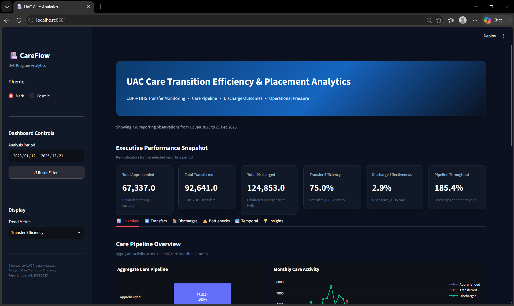
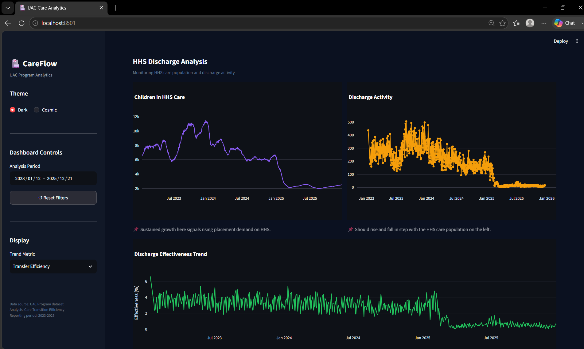
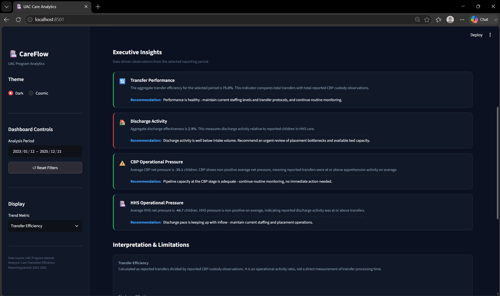

# UAC Care Transition Efficiency & Placement Outcome Analytics

> A data analytics and interactive dashboard project for monitoring care transitions, operational pressure, discharge activity, and aggregate placement-related outcomes in the Unaccompanied Children (UAC) Program.


---

## 📌 Project Overview

The **UAC Care Transition Efficiency & Placement Outcome Analytics** project analyzes aggregate UAC program reporting data to understand how children move through the care pipeline, from **CBP custody to HHS care and eventual discharge**.

Traditional monitoring often focuses on how many children are currently in custody or care. This project extends that view by analyzing:

- CBP → HHS transfer activity
- HHS discharge activity
- Transfer efficiency
- Discharge effectiveness
- Pipeline throughput
- Operational pressure
- Potential bottleneck periods
- Monthly and yearly trends
- Weekday reporting patterns

The project combines **Python-based data analysis** with an interactive **Streamlit dashboard** designed for operational monitoring and decision support.

---

## 🎯 Problem Statement

The UAC program operates through multiple stages:

```
Apprehension
     ↓
CBP Custody
     ↓
Transfer to HHS
     ↓
HHS Care
     ↓
Discharge / Placement
```

Aggregate custody counts provide information about the size of the population, but they do not by themselves show how efficiently children are moving through the pipeline.

This project addresses the following questions:

- How effectively are children being transferred from CBP custody to HHS care?
- Is HHS discharge activity keeping pace with incoming transfers?
- During which periods does operational pressure increase?
- Are transfer and discharge patterns changing over time?
- Which reporting periods may require closer operational review?

---

## 🎯 Objectives

- Measure CBP → HHS transition activity
- Develop operational efficiency indicators
- Analyze HHS discharge activity
- Identify periods of high operational pressure
- Examine temporal changes in transfers and discharges
- Monitor aggregate pipeline throughput
- Build an interactive dashboard for stakeholders
- Provide actionable analytical insights for program management

---

## 📊 Dataset

The project uses the UAC Program dataset containing aggregate reporting observations from 2023–2025.

### Dataset Columns

| Original Column | Analytical Name | Description |
|---|---|---|
| Date | `date` | Reporting date |
| Children apprehended and placed in CBP custody* | `apprehended` | Children entering CBP custody |
| Children in CBP custody | `cbp_custody` | Children reported in CBP custody |
| Children transferred out of CBP custody | `transferred` | Children transferred from CBP |
| Children in HHS Care | `hhs_care` | Children reported in HHS care |
| Children discharged from HHS Care | `discharged` | Children discharged from HHS care |

### Dataset Coverage

| Metric | Value |
|---|---|
| Raw rows | 1,170 |
| Valid observations | 720 |
| Blank rows removed | 450 |
| Date range | January 2023 – December 2025 |
| Duplicate dates | None |
| Missing values after cleaning | None |

---

## 🔍 What Was Done

### 1. Data Understanding

The raw dataset was first examined to understand its structure and quality, including:

- Dataset dimensions
- Column names and data types
- First and last observations
- Missing-value analysis
- Completely blank rows
- Duplicate records
- Unique dates and date validity
- Reporting-date gaps
- Numeric variable distributions and descriptive statistics
- Day-of-week distribution
- Monthly and yearly observation coverage

This step established the reporting structure and identified that the dataset contains irregular observation intervals, meaning missing dates should not automatically be interpreted as zero activity.

### 2. Data Cleaning

The raw dataset was cleaned and transformed into an analysis-ready dataset:

- Removed completely blank rows
- Renamed columns to concise analytical names
- Converted dates into datetime format
- Removed commas from HHS care values
- Converted numeric columns to numeric data types
- Sorted records chronologically
- Checked duplicate dates
- Checked negative values
- Checked logical relationships between variables
- Validated the final dataset

The cleaned dataset is stored at: `data/processed/uac_cleaned.csv`

### 3. Exploratory Data Analysis

Exploratory analysis was performed to understand the overall behavior of the UAC care pipeline, examining:

- Average pipeline activity
- CBP custody trends
- HHS care population trends
- Apprehension, transfer, and discharge activity
- Monthly and yearly averages, and year-over-year changes
- Variable distributions and outliers
- Correlations
- Day-of-week activity

Separate visualizations were used for CBP and HHS populations because the scale of HHS care is substantially larger than the CBP custody population.

### 4. Care Pipeline Analysis

The dataset was modeled as a multi-stage operational pipeline:

```
Apprehension
     ↓
CBP Custody
     ↓
Transfer
     ↓
HHS Care
     ↓
Discharge
```

This allowed the analysis to move beyond simple population counts and examine the relationship between incoming and outgoing activity, focusing on:

- Pipeline entry activity
- Transfer activity
- HHS care population
- Discharge activity
- Differences between incoming and outgoing activity
- Overall pipeline movement

### 5. Efficiency & Outcome Analysis

Several operational indicators were developed from the available aggregate data.

**Transfer Efficiency Ratio**
```
Transfer Efficiency = Total Transferred / Total CBP Custody
```
Provides an aggregate indicator of transfer activity relative to the reported CBP custody population.

**Discharge Effectiveness**
```
Discharge Effectiveness = Total Discharged / Total HHS Care
```
Measures discharge activity relative to the reported HHS-care population.

**Pipeline Throughput**
```
Pipeline Throughput = Total Discharged / Total Apprehended
```
Provides an aggregate view of how discharge activity compares with incoming apprehension activity over the analysis period.

**Outcome Stability**

Coefficient of variation was used to evaluate the relative variability of transfer-efficiency and discharge-effectiveness indicators.

### 6. Bottleneck & Operational Pressure Analysis

Operational pressure indicators were created to identify periods where incoming activity exceeded outgoing activity.

**CBP Net Pressure**
```
CBP Net Pressure = Apprehended - Transferred
```

**HHS Net Pressure**
```
HHS Net Pressure = Transferred - Discharged
```

Positive values indicate that incoming activity exceeded outgoing activity during the reporting observation.

The analysis included:

- Pressure trends and cumulative pressure
- Pressure distributions
- Highest-pressure reporting periods
- 75th-percentile pressure thresholds
- Standardized pressure scores
- Transfer efficiency versus CBP pressure

These indicators help identify periods that may require additional operational investigation.

> **Note:** Net pressure is an analytical indicator and should not automatically be interpreted as a literal backlog without confirming the precise stock-and-flow definitions of the source reporting system.

### 7. Temporal & Outcome Analysis

The project examined how operational activity changes over time, including:

- Monthly transfer and discharge activity
- Monthly transfer–discharge gaps
- Year-over-year comparisons and percentage changes
- Day-of-week activity
- Monthly operational pressure
- Yearly outcome stability

Temporal analysis helps identify persistent changes and periods that may warrant closer review.

---

## 📈 Key Performance Indicators

| KPI | Formula | Purpose |
|---|---|---|
| Transfer Efficiency | Transferred ÷ CBP Custody | Measures relative transfer activity |
| Discharge Effectiveness | Discharged ÷ HHS Care | Measures relative discharge activity |
| Pipeline Throughput | Discharged ÷ Apprehended | Measures aggregate pipeline output |
| CBP Net Pressure | Apprehended − Transferred | Indicates CBP operational pressure |
| HHS Net Pressure | Transferred − Discharged | Indicates HHS operational pressure |
| Outcome Stability | Coefficient of Variation | Measures variability in efficiency indicators |

---

## 🖥️ Interactive Dashboard

The project includes an interactive Streamlit dashboard designed for operational monitoring, providing:

- Date-range filtering
- KPI cards
- Transfer monitoring
- Discharge monitoring
- Bottleneck analysis
- Temporal analysis
- Operational pressure monitoring
- Efficiency distributions
- Efficiency vs. pressure analysis
- Monthly transfer–discharge gap
- Automated analytical insights
- Filtered-data download
- Dark/light dashboard themes

### 📸 Dashboard Preview

Dashboard screenshots are stored in `dashboard/assets/`.

**Dashboard Overview**



**Discharges Analysis**



**Insights**



### 📊 Dashboard Sections

**Overview** — Total apprehensions, transfers, discharges, transfer efficiency, discharge effectiveness, pipeline throughput, monthly care activity, and operational pressure at a glance.

**Transfers** — Focuses on the CBP → HHS transition: CBP custody vs. transfers, transfer efficiency trend and distribution, CBP operational pressure.

**Discharges** — Focuses on the HHS discharge stage: HHS care population, discharge activity, discharge effectiveness, discharge trends.

**Bottlenecks** — Highlights potential operational pressure: CBP/HHS net pressure, cumulative pressure, highest-pressure periods, transfer efficiency vs. CBP pressure.

**Temporal** — Examines changes over time: monthly transfers vs. discharges, transfer–discharge gap, year-over-year activity, weekday activity, monthly operational pressure.

**Insights** — Management-oriented observations and recommendations based on the analytical indicators.

---

## 🛠️ Technology Stack

| Category | Tools |
|---|---|
| Programming | Python, Pandas, NumPy |
| Visualization | Matplotlib, Seaborn, Plotly |
| Dashboard | Streamlit |
| Development | Jupyter Notebook, VS Code, Git / GitHub |

---

## 📁 Project Structure

```
Care-Transition-Analytics/
│
├── data/
│   ├── raw/
│   │   └── HHS_Unaccompanied_Alien_Children_Program.csv
│   │
│   └── processed/
│       ├── uac_cleaned.csv
│       └── uac_eda.csv
│
├── notebooks/
│   ├── 01_data_understanding.ipynb
│   ├── 02_data_cleaning.ipynb
│   ├── 03_exploratory_data_analysis.ipynb
│   ├── 04_care_pipeline_analysis.ipynb
│   ├── 05_efficiency_analysis.ipynb
│   ├── 06_backlog_bottleneck_analysis.ipynb
│   └── 07_temporal_outcome_analysis.ipynb
│
├── src/
│   ├── data_cleaning.py
│   ├── feature_engineering.py
│   ├── kpi_calculations.py
│   ├── bottleneck_analysis.py
│   └── visualization.py
│
├── dashboard/
│   ├── app.py
│   ├── components.py
│   ├── styles.css
│   └── assets/
│       ├── dashboard_overview.png
│       ├── transfer_analysis.png
│       └── bottleneck_analysis.png
│
├── reports/
│   ├── research_paper.pdf
│   ├── executive_summary.pdf
│   └── figures/
│
├── requirements.txt
├── README.md
├── .gitignore
└── LICENSE
```

---

## 🚀 Installation

Clone the repository:

```bash
git clone https://github.com/YOUR_USERNAME/care-transition-analytics.git
cd care-transition-analytics
```

Create a virtual environment:

**Windows**
```bash
python -m venv .venv
.venv\Scripts\activate
```

**macOS / Linux**
```bash
python3 -m venv .venv
source .venv/bin/activate
```

Install dependencies:

```bash
pip install -r requirements.txt
```

---

## ▶️ Running the Analysis

Launch Jupyter:

```bash
jupyter notebook
```

Then open the notebooks in the following order:

1. `01_data_understanding.ipynb`
2. `02_data_cleaning.ipynb`
3. `03_exploratory_data_analysis.ipynb`
4. `04_care_pipeline_analysis.ipynb`
5. `05_efficiency_analysis.ipynb`
6. `06_backlog_bottleneck_analysis.ipynb`
7. `07_temporal_outcome_analysis.ipynb`

---

## ▶️ Running the Dashboard

From the project root:

```bash
streamlit run dashboard/app.py
```

The dashboard will open in your browser.

---

## 📄 Project Deliverables

This project produces three major deliverables:

### 1. Research Paper
Documents the problem statement, dataset, methodology, analytical approach, KPIs, findings, limitations, and future improvements.

📍 `reports/research_paper.pdf`

### 2. Executive Summary
A stakeholder-focused summary containing key findings, management implications, recommended actions, KPI interpretation, and dashboard decision areas.

📍 `reports/executive_summary.pdf`

### 3. Interactive Dashboard
A Streamlit application for exploring pipeline activity, transfer efficiency, discharge effectiveness, operational pressure, temporal trends, and bottleneck indicators.

📍 `dashboard/app.py`

---

## ⚠️ Limitations

The analysis should be interpreted within the limitations of the aggregate dataset.

- **No individual-level processing times** — The dataset does not provide individual-level timestamps connecting apprehension, transfer, and discharge events. Efficiency ratios are therefore operational indicators rather than true processing-time measurements.
- **Aggregate discharge data** — Discharge activity should not automatically be interpreted as individual-level reunification success, since the dataset does not provide detailed placement outcomes for each child.
- **Irregular reporting** — Observations are not recorded for every calendar day. Missing dates therefore should not be treated as zero activity.
- **Pressure ≠ confirmed backlog** — Net pressure identifies periods where incoming activity exceeds outgoing activity, but additional information is required to confirm an actual accumulated backlog.
- **Uneven weekday coverage** — Weekday comparisons should be interpreted carefully because reporting observations are not evenly distributed across all weekdays.

---

## 🔮 Future Improvements

Future versions could improve the analytical framework by adding:

- Individual-level case timelines
- Transfer and discharge timestamps
- Actual processing durations
- Sponsor placement outcomes
- Reunification success indicators
- Geographic and facility-level breakdowns
- Predictive backlog forecasting
- Time-series forecasting
- Automated anomaly detection
- Real-time data integration
- Automated stakeholder reports
- Alert notifications for sustained pressure

With richer data, the project could move from aggregate operational monitoring toward direct measurement and prediction of care-transition performance.

---

## 📌 Main Takeaway

This project demonstrates how aggregate UAC program data can be transformed from simple custody reporting into a care-transition monitoring framework.

```
Data Cleaning → Exploratory Analysis → Pipeline Modeling →
Efficiency Metrics → Pressure & Bottleneck Analysis →
Temporal Analysis → Interactive Dashboard
```

The project provides stakeholders with a structured way to monitor transfers, discharges, operational pressure, pipeline throughput, and changes over time.

---

## 👤 Author

**Mahi Ahalawat**
Robotics & AI Engineering Student

**Areas of Interest:** Data Analytics · Machine Learning · Artificial Intelligence · Robotics · Computer Vision · IoT

---

## 📜 License

This project is available under the license included in the repository.

---

## ⭐ Project Summary

**UAC Care Transition Efficiency & Placement Outcome Analytics**

`Dataset → Analysis → KPIs → Bottleneck Detection → Dashboard → Decision Support`

Built using Python, Pandas, NumPy, Plotly, Matplotlib, Seaborn, Streamlit, and Jupyter Notebook.